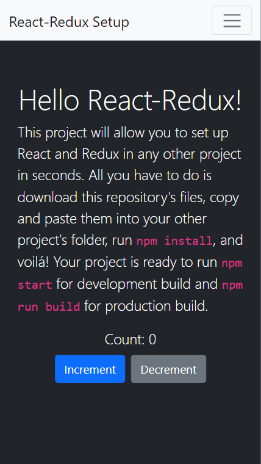

# My Portfolio

"Your portfolio is one of the most powerful tools in your software developer toolbox; it’s the easiest way of showing what you’re truly capable of as a developer, and is a quick and simple way for recruiters and hiring managers to get an idea of what you can bring to their teams." - Microverse

## Mobile

## Live Demo

[Live Demo Link](https://dicodiaz.com.co)

## Built With

- React
- Redux
- Bootstrap
- VSCode
- Git & GitHub

## Getting Started

To get Rthis project up and running, follow these simple steps:

1. Clone the repository into your machine (Or download the .zip file and extract).
2. Open the project's folder.
3. Run `npm install`
4. Run `npm start`

### Setup

Follow the steps described before.

## Authors

👤 **Dico Diaz Dussan**

- GitHub: [@dicodiaz](https://github.com/dicodiaz)
- LinkedIn: [Dico Diaz Dussan](https://www.linkedin.com/in/dico-diaz-dussan/)
- Portfolio: [dicodiaz.com.co](https://dicodiaz.com.co)

## 🤝 Contributing

Contributions, issues, and feature requests are welcome!

Feel free to check the [issues page](../../issues/).

## Show your support

Give a ⭐️ if you like this project!

## 📝 License

This project is [MIT](./MIT.md) licensed.
